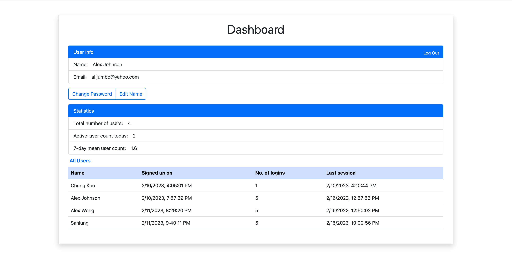

<h2 align="center">Simple Auth & Dashboard</h2>

<h4 align="center">A Next.js App Running on Express and PostgreSQL</h4>

A Job Application Take-home Project

## About

This is a fullstack [Next.js](https://nextjs.org/) project bootstrapped with [`create-next-app`](https://github.com/vercel/next.js/tree/canary/packages/create-next-app). The app runs on a [Node.js](https://nodejs.org/en/)/[Express](https://expressjs.com/) server and [PostgreSQL](https://www.postgresql.org/) database.

The project is created per a take-home and made public to provide for examination and testing by the entity who handed it out.

### Contributor

### License

MIT license.
